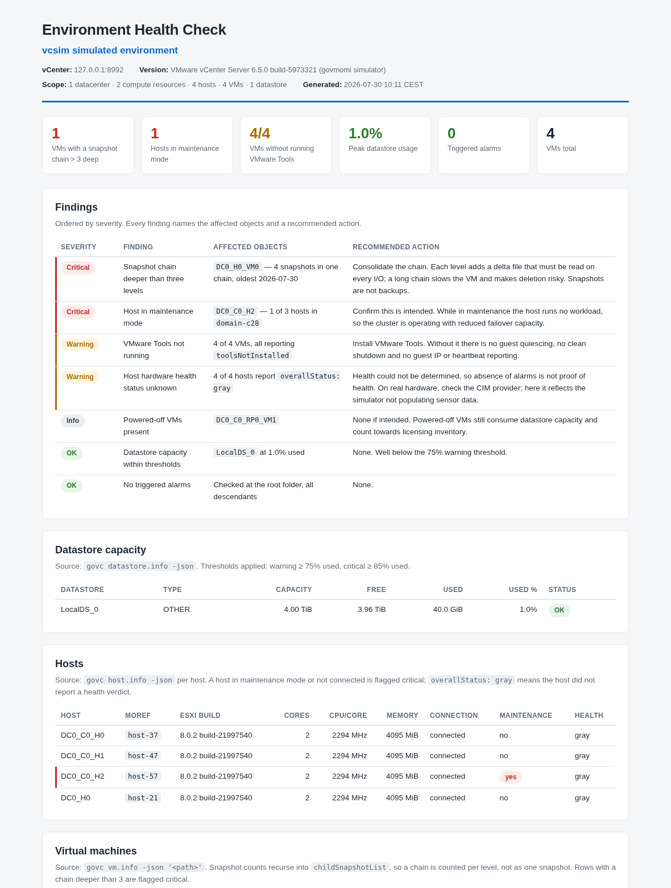

# claude-vsphere-skill

A [Claude Code](https://docs.claude.com/en/docs/claude-code) skill that turns Claude into a vSphere administrator using [govc](https://github.com/vmware/govmomi/tree/main/govc) — inventory, reporting, snapshot audits, root-cause analysis, and safe VM/host/cluster management for VMware vCenter and ESXi.

Ask in plain language:

> "Which VMs have snapshots, and how old are they?"
> "VM web-01 was down last night. Find out what happened and when."
> "Datastore capacity report — flag anything over 85% full."
> "Prepare esx02 for patching."
> "Health check as an HTML file I can send to the customer." ([what that looks like](#reports-you-can-hand-to-someone))

And Claude picks the right govc commands, batches queries efficiently, parses the JSON, and answers like a colleague — including pushing back when your premise is wrong:


*(Real session against a real vCenter: asked about an outage "last night", Claude proved from rotated `vmware.log` files — beyond vCenter's event retention — that the VM had been down since December, and reconstructed the host outage that caused it. All read-only.)*

## Safety first

Instructions the skill enforces on every session:

- **Read-only first** — reporting questions are answered with `*.info`, `find`, `collect`, `events`, `metric.sample`; never by changing state.
- **Confirmation for destructive operations** — `vm.destroy`, `snapshot.remove '*'`, `datastore.rm`, `host.shutdown` and friends require Claude to show the exact objects affected and get an explicit yes.
- **Dry-run mentality** — before bulk operations, Claude prints the object list so you approve a list, not a pattern.
- **Graceful before hard** — guest shutdown before power-off, guest reboot before reset.
- **Unattended runs keep the boundary** — a scheduled report run may pick default thresholds and write its own report file, but it may not issue a single non-read command; see [`docs/scheduled-reports.md`](docs/scheduled-reports.md).

These are instructions to the model. For deterministic, code-level enforcement on top of them, add the policy hook below — and for a hard boundary, run govc with a least-privilege vCenter role: with a read-only account the skill physically cannot change anything. The three layers compose.

## Deterministic security layer (optional)

`guard/` adds enforcement that does not depend on the model behaving: a
[PreToolUse hook](https://docs.claude.com/en/docs/claude-code/hooks) classifies every
`govc` invocation *before it executes* — including every stage of a pipeline — and
applies a tier from a policy file the agent is blocked from editing:

| Tier | Read (`*.info`, `find`, `collect`, metrics…) | Mutate (create, clone, power-on, migrate…) | Destroy (`vm.destroy`, `snapshot.remove`, anything that stops a VM…) |
|---|---|---|---|
| `readonly` | ✅ | ❌ denied | ❌ denied |
| `standard` | ✅ | ✅ | ❌ denied |
| `full` | ✅ | ✅ | ⚠️ always requires your confirmation in the UI |

Design choices that make it deterministic rather than advisory:

- **Fail closed.** No policy file, unreadable policy, invalid tier → `readonly`.
- **Unknown ≠ safe.** A subcommand the classifier doesn't know is treated as a mutation,
  never as a read. Destructive commands are caught by an explicit list *plus* a suffix
  heuristic (`rm`, `remove`, `destroy`, `shutdown`, `reboot`, `unregister`), so
  destructive subcommands added in future govc releases stay covered.
- **Indeterminate ≠ safe either.** If the subcommand isn't literally on the command line
  — `… | xargs govc`, `$BIN vm.destroy`, `govc $(…)` — it is treated as *destroy*, not
  as a mutation. Only `readonly` denies mutations, so anything less would let ordinary
  shell indirection walk straight through `standard` and `full`.
- **Flag-aware.** `vm.power -on` is a mutation; `-off`, `-reset`, `-suspend` and also
  `-s`/`-r` (guest shutdown/reboot) are destroy-class — a graceful stop still stops the
  workload — and `-off=true` is normalised to `-off`. `govc env` is denied at every tier
  unless it names one specific non-secret variable, because `-json`, `-dump` and `-x` all
  print `GOVC_PASSWORD` in cleartext.
- **Scripts are read through.** A `govc` call the model writes into a file with the
  `Write` tool is not in the Bash command at all, so `bash ./x.sh`, `./x.sh`, `source`
  and nested scripts are opened and classified too. Files a command only *reads* are
  not judged — `cat notes.md` isn't denied for what the prose in it mentions.
- **Policy is root-of-trust.** It lives in `~/.config/govc-guard/policy`, outside any
  project. The installer adds settings.json deny rules covering both the policy file and
  the hook script — protecting only the policy value would leave the code that reads it
  editable — and the hook itself refuses any shell command that writes to either,
  resolving `cd`, `~` and relative paths first. `deny =` / `allow =` lines let you
  tighten or relax individual subcommands.

```bash
./guard/setup.sh standard    # or: readonly | full
./guard/test-policy.sh       # classifier + hook protocol + deployment checks
```

Works with stock govc — no wrapper required — and coexists with the privacy wrapper
below: the guard decides *whether* a command runs, the wrapper decides *what the model
sees*. Same honesty as the wrapper: this matches text, and it can only read what is on
disk when it runs — content piped into a shell from somewhere it cannot see
(`curl … | bash`) is not covered, and a deliberately hostile agent could obfuscate
around text matching in other ways. What it does guarantee is that the model cannot
talk itself into a `vm.destroy`: the deny happens in code after it tries, hiding the
command in a script does not help, and it cannot raise its own tier to get there. The
hard boundary against a hostile agent remains a least-privilege vCenter role.
Linux/macOS; on Windows run Claude Code from WSL or Git Bash to use it.

## Requirements

- [Claude Code](https://docs.claude.com/en/docs/claude-code)
- `govc` on PATH (step 1 below) — or let `test-unix.sh` / `test-windows.ps1` install it for you
- A vCenter or ESXi endpoint — or none at all: the test scripts can run against the bundled simulator
- `jq` is recommended for the report patterns on bash-like shells; native PowerShell uses `ConvertFrom-Json` and doesn't need it

## Installation

### Step 1 — install `govc`

| Platform | Command |
|---|---|
| macOS | `brew install govc` |
| Windows | `scoop install govc` |
| Linux | download below, or `.deb`/`.rpm` from [releases](https://github.com/vmware/govmomi/releases) |
| Any | `go install github.com/vmware/govmomi/govc@latest` |

Linux/macOS direct download. Note the `aarch64` → `arm64` mapping — `uname -m` reports
`aarch64` on ARM, but the published asset is named `arm64`, so the naive one-liner 404s:

```bash
OS=$(uname -s); ARCH=$(uname -m)
[ "$ARCH" = "aarch64" ] && ARCH=arm64
curl -fL "https://github.com/vmware/govmomi/releases/latest/download/govc_${OS}_${ARCH}.tar.gz" \
  | sudo tar -C /usr/local/bin -xzf - govc
```

Verify with `govc version`. For `jq`: `brew install jq` / `apt install jq` / `scoop install jq`.

### Step 2 — install the skill

Copy the `govc/` folder — that's the whole skill — into your skills directory:

```bash
git clone https://github.com/vchaindz/claude-vsphere-skill.git
cd claude-vsphere-skill

# personal (all projects)
mkdir -p ~/.claude/skills && cp -r govc ~/.claude/skills/

# or per-project
mkdir -p /path/to/project/.claude/skills && cp -r govc /path/to/project/.claude/skills/
```

```powershell
git clone https://github.com/vchaindz/claude-vsphere-skill.git
cd claude-vsphere-skill

$dst = "$env:USERPROFILE\.claude\skills\govc"
New-Item -ItemType Directory -Force -Path (Split-Path $dst) | Out-Null
if (Test-Path $dst) { Remove-Item $dst -Recurse -Force }   # avoid nesting on re-install
Copy-Item .\govc $dst -Recurse -Force
```

### Step 3 — set the connection variables *before* starting Claude Code

Claude Code inherits the environment of the terminal that launches it, and each command it
runs is a separate process — so a variable exported mid-session does not stick. Set these
in your shell first, then run `claude`. If you change them, restart Claude Code.

```bash
# bash / zsh — Linux, macOS, WSL, Git Bash
export GOVC_URL='vcenter.example.com'
export GOVC_USERNAME='administrator@vsphere.local'
export GOVC_PASSWORD='...'
export GOVC_INSECURE=true     # lab only, for self-signed certs; prefer GOVC_TLS_CA_CERTS
```

```powershell
# PowerShell — this session
$env:GOVC_URL      = 'vcenter.example.com'
$env:GOVC_USERNAME = 'administrator@vsphere.local'
$env:GOVC_PASSWORD = '...'
$env:GOVC_INSECURE = 'true'

# or persistently (applies to NEW terminals — the current one keeps the old values)
setx GOVC_URL      "vcenter.example.com"
setx GOVC_USERNAME "administrator@vsphere.local"
setx GOVC_PASSWORD "..."
```

```bat
REM cmd.exe
set GOVC_URL=vcenter.example.com
set GOVC_USERNAME=administrator@vsphere.local
set GOVC_PASSWORD=...
```

Confirm with `govc about`. To inspect a single variable use `govc env GOVC_URL` — always
name it, because `govc env` on its own prints `GOVC_PASSWORD` in cleartext, and so do
`govc env -json`, `-dump` and `-x`.

To persist on Linux/macOS, add the `export` lines to `~/.zshrc` (macOS default shell) or
`~/.bashrc`.

## Platform support

| Platform | Shell | Status |
|---|---|---|
| Linux (x86_64, arm64) | bash / zsh | Tested against a real vCenter and against the simulator |
| macOS (Intel, Apple Silicon) | zsh / bash | Same commands as Linux; no GNU-only flags in any pipeline |
| Windows | PowerShell 5.1 / 7+ | Tested against the simulator; every reference file carries PowerShell examples |
| Windows | Git Bash / WSL | Use the bash examples unchanged |

## Try it without touching production

`vcsim`, the vCenter simulator from the govmomi project, answers nearly all govc calls with a simulated inventory. The included test scripts set everything up and validate the skill's command patterns:

```powershell
# Windows: installs govc + vcsim, installs the skill, runs 24 smoke tests against the simulator
powershell -ExecutionPolicy Bypass -File .\test-windows.ps1
```

```bash
# Linux/macOS: installs govc + vcsim + the skill, runs 31 smoke tests against the simulator.
# No vCenter and no credentials needed — nothing real is touched.
./test-unix.sh --vcsim

# Or against your real vCenter: ~28 READ-ONLY tests
./test-unix.sh
# optional snapshot create/remove cycle on an explicitly named non-production VM:
./test-unix.sh --write-test my-test-vm
```

Recommended first interactive test: start `claude`, ask for an inventory report, then ask it to destroy a test VM — it should list the VM and ask for confirmation before doing anything.

## Reports you can hand to someone

Quick questions get answered as a Markdown table in the chat. Ask for a report **as a
file** and you get a single self-contained HTML document instead — one file, no CDN links,
no external fonts or images, so it survives being emailed, archived, or opened on an
air-gapped management workstation.

Any of these triggers it:

> "Health check as an HTML file."
> "Snapshot audit — save it as a report I can send to the customer."
> "Write me a capacity report for the ACME assessment."



*(The real file, generated against the vcsim simulator — [examples/health-check-vcsim-2026-07-30.html](examples/health-check-vcsim-2026-07-30.html). Cropped; the full report continues with VM, snapshot and alarm sections.)*

**Findings come first.** Every report opens with a severity-ordered findings table — worst
first, each row naming the *exact* affected objects and a concrete recommended action.
A healthy category is stated as a finding too ("checked and found healthy"), because
silence is not a result. Then KPI cards for the headline numbers, then the supporting data
tables with click-to-sort columns.

**Every number is auditable.** Each section states the govc command it came from and the
thresholds applied, and the footer records how the data was gathered. If a query failed,
the report says "not collected" and why — it never guesses. Default thresholds (overridable
by just saying so):

| Check | Warning | Critical |
|---|---|---|
| Datastore used | ≥ 75% | ≥ 85% |
| Snapshot age | > 3 days | > 7 days, or > 3 in a chain |
| Host disconnected / unexpectedly in maintenance | — | always |
| VMware Tools | not running | — |
| Triggered alarms | yellow | red |

Files are named `<report-type>-<environment>-<YYYY-MM-DD>.html`. Say it's for a client (or
name one) and you additionally get the client name in the header and an executive summary
in prose above the tables, with recommendations phrased as recommendations.

### Seeing it before you install anything

`examples/` holds the same health check generated twice against the simulator:

| File | What it shows |
|---|---|
| [`health-check-vcsim-2026-07-30.html`](examples/health-check-vcsim-2026-07-30.html) | normal output, real object names |
| [`health-check-vcsim-tokens-2026-07-30.html`](examples/health-check-vcsim-tokens-2026-07-30.html) | the identical report with the [privacy wrapper](#optional-keeping-real-identifiers-away-from-the-model) active — every name, MoRef, UUID and address replaced by a stable pseudonym, and the vCenter endpoint withheld |

Open them side by side: same findings, same numbers, same layout. The only difference is
whether a real identifier ever left the host. With the wrapper active a report is written
in tokens, and `govc-safe rehydrate <file>` gives you a cleartext copy locally.

The template itself is `govc/assets/report-template.html`; the rules for filling it —
structure, severity vocabulary, thresholds, consultant mode — are in
`govc/references/report-template.md`.

## What's in the skill

```
govc/
├── SKILL.md                      # workflow, safety rules, command map, Windows notes
├── assets/
│   └── report-template.html      # self-contained styled HTML report skeleton
└── references/                   # loaded on demand (progressive disclosure)
    ├── setup.md                  # install, auth, TLS, sessions, troubleshooting, vcsim
    ├── inventory-reporting.md    # find/collect/jq patterns, metrics, events, alarms
    ├── health-check.md           # the fixed nine-check checklist, severities, baseline diff
    ├── report-template.md        # how report files are structured, severities, thresholds
    ├── vm-lifecycle.md           # create, clone, power, migrate, guest ops, destroy
    ├── snapshots.md              # create, audit, revert, cleanup workflow
    ├── host-cluster.md           # maintenance mode, DRS/HA rules, pools, esxcli
    └── storage-network.md        # datastores, disks, vSwitch/DVS/portgroups
```

Battle-tested details baked in from real-world runs: PowerShell splits unquoted dotted flags like `-runtime.powerState` (quote them), `host.info` needs an explicit host when there's more than one, multi-datacenter vCenters need `-dc`/`GOVC_DATACENTER` context, an empty datacenter answers `datastore.info` with a misleading "not found", `snapshot.remove` rejects the `id` integer that `vm.info -json` shows and wants the `snapshot-NNNNN` managed object ID instead, a snapshot audit must recurse into `childSnapshotList` or it reports a deep chain as a single snapshot, `jq`'s `fromdateiso8601` rejects the fractional seconds vSphere puts in every timestamp, `govc events` has no time window at all — only a count, capped at 1000, above which it returns *zero* events rather than an error — and `govc cluster.info` does not exist, so HA and DRS state come from `govc collect -json <cluster> configurationEx`, read whole, because the nested path a simulator happily accepts fails on a real vCenter with `InvalidProperty`.

Every reference file is cross-platform: bash examples work on Linux, macOS, WSL, and Git Bash, and each command that behaves differently under native PowerShell carries a `powershell` twin. Batch pipelines use `tr '\n' '\0' | xargs -0` rather than the GNU-only `xargs -d '\n'`, so they run unmodified on macOS and survive VM names containing spaces.

## Scheduled and unattended reports

The health check is a **fixed nine-check list** — same checks, same order, same thresholds
every run — so two runs are comparable, and it writes a small baseline file next to the
report so the next run can lead with "changed since last run". That is what makes it worth
scheduling:

```bash
claude -p "/govc Run the fixed environment health check. Unattended: no questions,
use defaults, write the HTML report to /var/lib/vsphere-health." \
  --permission-mode dontAsk --max-turns 40
```

The last line of output is machine-readable, so a cron wrapper can act on it without
parsing prose:

```
GOVC-REPORT report=health-check env=acme-prod status=critical critical=2 warning=5 ok=4 info=1 baseline=changed path=/var/lib/vsphere-health/health-check-acme-prod-2026-07-30.html
```

Pre-authorise rather than bypass: an allowlist plus `--permission-mode dontAsk` means an
unforeseen command *fails loudly* instead of executing unattended — the opposite of what
`--dangerously-skip-permissions` gives you, which in any case refuses to start under
root or `sudo` and so never runs from a root crontab at all. Pair it with guard tier
`readonly` and a read-only vCenter account, and the job cannot change vSphere even if the
model tries.

Full recipes — cron, systemd timers, Windows Task Scheduler, the settings block with the
five rules people get wrong, and turn-limit guidance — are in
[`docs/scheduled-reports.md`](docs/scheduled-reports.md).

## Optional: keeping real identifiers away from the model

> **Entirely optional.** Everything above works on its own. Skip this section
> unless your vSphere data must not reach a model provider — nothing in the
> `govc/` skill depends on it.

By default this skill runs `govc` through the agent's shell, so **raw output —
VM names, IPs, MACs, usernames in events, guest OS versions — becomes part of the
conversation** and is sent to whichever model provider you use.

If that is not acceptable, `wrapper/` contains a pseudonymising proxy.
`govc-safe` holds the credentials, runs the real command, and rewrites every
identifier to a stable token before anything is printed:

```
$ govc-safe find / -type m
/DC-01/vm/VM-0001
/DC-01/vm/VM-0002
```

Tokens are stable across commands and sessions, so the model can still correlate
objects and act on them (`govc-safe vm.power -off VM-0017` resolves the token
before calling vCenter).

On the JSON path the wrapper walks the parsed document rather than its text, so
keys and structure come through exactly as govc emitted them and only values are
rewritten. Managed object references are preserved as tokens —
`"self": {"type": "VirtualMachine", "value": "VM-0001"}` — which is what lets the
model join two outputs together without ever seeing a name. Plain-text output has
no such structure to lean on, so a VM named after a field label can have the
label tokenised alongside it; that is over-redaction rather than a leak, and
`-json` avoids it.

**You still read everything in cleartext.** A `MessageDisplay` hook rehydrates
Claude's replies as they render, so the model writes

> `VM-0001` is powered on with a 91-day snapshot `SNAP-01` on `DS-01`

and your terminal shows

> `ACME-PROD-SQL01` is powered on with a 91-day snapshot `pre-upgrade INC-88213` on `LocalDS_0`

This is display-only, which is the whole trick: *"the transcript and what Claude
sees keep the original"*, so the real names are never transmitted — they are
substituted locally, on your screen, after the response comes back. `/verbose`
shows the untouched text if you want to confirm exactly what left the machine.
For a cleartext copy on disk, `govc-safe rehydrate report.tsv`.

### Enabling it

Two steps. First, install — per-user, no root:

```bash
./wrapper/setup.sh          # installs govc-safe + the hook to ~/.local/bin
```

It stores your vCenter credentials in `~/.config/govc-safe/creds` (0600) instead
of your shell profile. That matters: Claude Code inherits the environment it is
launched from, so `export GOVC_PASSWORD=...` in `.zshrc` hands the agent working
credentials and bypasses the wrapper entirely. Remove those exports — the
wrapper reads the file instead.

Second — nothing else. `setup.sh` wires the three hooks into
`~/.claude/settings.json` for you, then tells you to restart Claude Code.

It **merges** rather than overwrites: your existing hooks, matcher groups and
deny rules are preserved, an existing `matcher: "Bash"` group is reused rather
than duplicated, and re-running converges instead of accumulating. The original
is backed up to `settings.json.bak.<timestamp>` first, and a malformed settings
file aborts the install rather than being truncated.

> ### ⚠️ Back up `settings.json` yourself first
>
> **Any program that edits your settings file is a risk, this one included.**
> `settings.json` is hand-edited, shared with every other tool you have wired in,
> and has no schema anyone can validate against — so a merge is always an
> informed guess about a structure someone else owns.
>
> ```bash
> cp ~/.claude/settings.json ~/settings.json.mine    # do this first
> ```
>
> The installer does take its own timestamped backup next to the original, and
> the merge is tested against a real settings file with pre-existing hooks. But
> the automatic backup lives in the same directory as the file it protects and is
> written by the same code you are trusting. Keep your own copy somewhere else.
>
> If anything looks wrong afterwards, restore and tell us what your file looked
> like:
>
> ```bash
> cp ~/settings.json.mine ~/.claude/settings.json    # or the .bak.<timestamp>
> ```
>
> Prefer to stay in control? `--no-settings` installs everything and touches
> nothing; the block it would have written is shown below, and
> `./wrapper/uninstall.sh` removes only its own entries.

```bash
./wrapper/setup.sh --project      # wire ./.claude/settings.json instead
./wrapper/setup.sh --yes          # non-interactive; credentials from the environment
./wrapper/setup.sh --no-settings  # install only, wire nothing
./wrapper/uninstall.sh            # reverse it; prompts before the sensitive files
```

<details>
<summary>What it writes to settings.json</summary>

```json
{
  "permissions": { "deny": ["Bash(*GOVC_PASSWORD*)"] },
  "hooks": {
    "PreToolUse":  [{ "matcher": "Bash",
      "hooks": [{ "type": "command", "command": "~/.local/bin/govc-guard.py" }] }],
    "PostToolUse": [{ "matcher": "Bash",
      "hooks": [{ "type": "command", "command": "~/.local/bin/govc-guard.py" }] }],
    "MessageDisplay": [
      { "hooks": [{ "type": "command", "command": "~/.local/bin/govc-guard.py" }] }]
  }
}
```

`MessageDisplay` carries no `matcher` — that event does not support one. And
there is deliberately **no `"Bash(govc:*)"` deny rule**: deny rules are evaluated
regardless of what a hook returns, so it would block the very command
`PreToolUse` is rewriting. The installer refuses to proceed if it finds one.

</details>

One script, three events:

| Event | What it does |
|---|---|
| `PreToolUse` | Rewrites `govc …` → `govc-safe …` before the command runs, so the stock skill needs no changes. Also refuses `rehydrate` and reads of the creds file. |
| `PostToolUse` | Backstop: scrubs IPs, MACs, UUIDs and emails from *any* command's output, not just govc. |
| `MessageDisplay` | Rehydrates replies on your screen only, so you read real names while the model keeps tokens. |

Then confirm it took:

```bash
./wrapper/test-deployment.sh
```

It fails if the hooks are not wired, if a wired hook points at a file that no
longer exists, if your environment still exports `GOVC_*`, or if the creds file
has the wrong mode.

**Platforms:** Linux and macOS. The Python is portable, but the installer and
tests are POSIX shell and no PowerShell version has been tested — on Windows,
run the wrapper from WSL or Git Bash.

**The skill needs no changes.** A `PreToolUse` hook rewrites `govc …` into
`govc-safe …` before the command runs — including every invocation in a
pipeline — so the stock `govc/` skill above keeps working exactly as written and
there is no second command name to learn:

```
Claude writes:   govc find / -type m | xargs -0 govc vm.info -json
actually runs:   govc-safe find / -type m | xargs -0 govc-safe vm.info -json
```

The wrapper is an allowlist, not a passthrough: it refuses `guest.*`,
`host.esxcli`, `logs`, `permissions.ls`, `sso.*`, and flags like `-trace` and
`-e` whose output cannot be redacted. Those refusals come back as ordinary tool
errors explaining what to use instead, so Claude adapts rather than stalling.

`wrapper/govc-private/` is an **optional** companion skill. You do not need it —
it adds data-minimisation habits (count before list, aggregate before row-level)
and explains the token vocabulary up front. Install it if you want those; skip it
and the stock skill still works anonymised.

### What this is, and what it isn't

It is an **anonymisation tool, not a security boundary.** It runs as you, so an
agent that deliberately set out to bypass it could — the hook matches command
text, and text matching loses to enough creativity.

What it does do is make sure the *normal* path never puts a real identifier in
front of the model, and that is where leaks actually happen: a routine
`vm.info -json` dumping every VM name, IP and annotation into the transcript
because nobody thought about it. That failure mode is eliminated.

If you need a hard boundary against a hostile agent, this is the wrong layer —
run Claude Code as a separate unix user that genuinely cannot read the
credentials, or don't give the agent vCenter access at all.

### Verifying it

Two scripts, testing two different things:

```bash
./wrapper/test-redaction.sh    # does anything leak?      (no install needed)
./wrapper/test-deployment.sh   # is my setup correct?     (after setup.sh)
```

`test-redaction.sh` runs the whole permitted command surface against vcsim —
including snapshots seeded with deliberately identifying names, and a VM named
after a JSON key — and fails if any real identifier, IP, MAC or UUID survives, or
if the allowlist stops behaving as specified. It also grades the opposite
direction, which a leak scan cannot see: a wrapper that deleted everything would
score a perfect pass, so the suite asserts that keys, structure and MoRefs
survive redaction intact.

`test-deployment.sh` checks the things the engine test cannot: that `govc-safe`
is on your PATH, that your shell is *not* exporting `GOVC_*`, that the creds file
is 0600, that plain `govc` cannot authenticate from a clean environment, and that
the hook actually denies direct `govc` and `rehydrate`.

Limits, stated plainly: free text (annotations, snapshot descriptions, event
messages) is **dropped**, not pseudonymised, because arbitrary prose cannot be
safely rewritten — a `value` with no `type` sibling counts as prose, while a
`{"type", "value"}` pair is a managed object reference and is tokenised instead.
Structure still leaks by design — counts, cluster shape,
guest-OS versions and ESXi build numbers survive, since removing them removes the
point of the reports. And this protects data in transit to the model; it is not a
substitute for a least-privilege vCenter role, which is what prevents unwanted
changes.

## Repository layout

| Path | Purpose |
|---|---|
| `govc/` | **The skill** — the only thing you need to copy |
| `guard/` | Optional deterministic security layer: policy hook, installer, tests |
| `wrapper/` | Optional pseudonymising proxy, hooks, installer, and both test suites |
| `wrapper/govc-private/` | Companion skill for token-space operation |
| `examples/` | Generated HTML reports (vcsim), with and without the wrapper |
| `docs/` | Operator documentation that is not part of the skill (scheduled runs) |
| `test-windows.ps1` | Windows setup + smoke test against vcsim |
| `test-unix.sh` | Linux/macOS setup + smoke test against vcsim (`--vcsim`) or a real vCenter |
| `images/` | Screenshots |

## Contributing

Issues and PRs welcome — especially additional gotchas from real environments, missing command patterns, and improvements to the safety rules. If Claude ever executes a destructive operation without confirmation, please file an issue with the transcript.

## License

Apache License 2.0 — see [LICENSE](LICENSE). `govc` and `vcsim` are part of the [govmomi](https://github.com/vmware/govmomi) project (also Apache 2.0), © Broadcom. Not affiliated with Broadcom/VMware or Anthropic.
